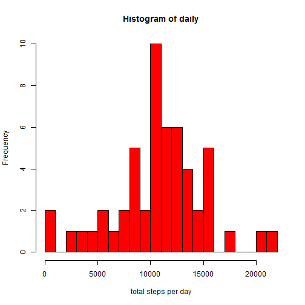
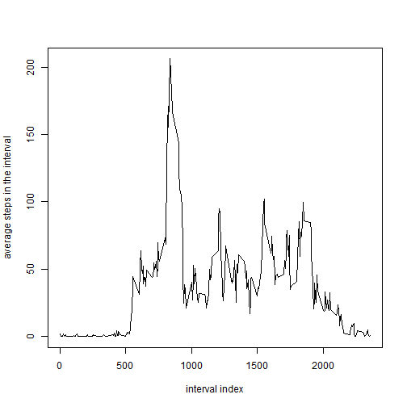
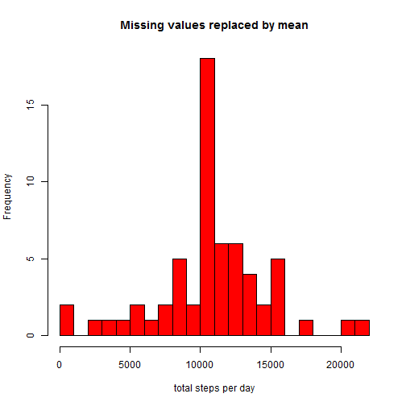

# project1
  Aiqun Huang


## Loading and processing data

```r
unzip("activity.zip")
data <- read.csv("activity.csv", header=TRUE)
data$date <- as.Date(data$date)
data_n <- na.omit(data)
```
## What is mean total number of steps taken per day?
Sum the steps taken per day and plot the histgram:

```r
daily <- tapply(data_n$steps, data_n$date, sum, simplify=T)
hist(x=daily, breaks=20, col="red", xlab="total steps per day")
```

 

The mean and median are :

```r
mean(daily)
```

```
## [1] 10766.19
```

```r
median(daily)
```

```
## [1] 10765
```

## What is the average daily activity patter

```r
avgSteps <- aggregate(data_n$steps, list(interval = as.numeric(as.character(data_n$interval))), FUN = "mean")
names(avgSteps)[2] <- "steps"
with(avgSteps,
     plot(interval,
          steps,
          type="l",
          xlab="interval index",
          ylab="average steps in the interval"))
```

 

Which 5-minute interval, on average across all the days in the dataset, contains the maximum number of steps?

```r
avgSteps[avgSteps$steps == max(avgSteps$steps), ]
```

```
##     interval    steps
## 104      835 206.1698
```
## Imputing missing values
the total number of missing values in the dataset

```r
sum(is.na(data))
```

```
## [1] 2304
```
Replace the missing value by the mean for that interval

```r
new_data <- data
nas <- is.na(new_data$steps)
avg <- tapply(new_data$steps, new_data$interval, mean, na.rm=TRUE, simplify=T)
new_data$steps[nas] <- avg[as.character(new_data$interval[nas])]
```
Making a histogram

```r
new_daily <- tapply(new_data$steps, new_data$date, sum, simplify=T)
hist(x=new_daily, breaks=20, col="red", xlab="total steps per day", main="Missing values replaced by mean")
```

 
The new mean and median are

```r
mean(new_daily)
```

```
## [1] 10766.19
```

```r
median(new_daily)
```

```
## [1] 10766.19
```
After inserting the missing values by the mean, the new mean does't change, the new median is 10766.19 compared to the original 10765.

## Are there differences in activity patterns between weekdays and weekends?
Create a factor varible `wk` with two levels `weekday` and `weekend`, the commented code also works.

```r
is_weekday <- function(d) {
    wd <- weekdays(d)
    ifelse (wd == "Saturday" | wd == "Sunday", "weekend", "weekday")
}
#new_data$weekdays <- factor(format(new_data$date, "%A"))
#levels(new_data$weekdays)
#levels(new_data$weekdays) <- list(weekday = c("Monday", "Tuesday",
#                                             "Wednesday", 
#                                             "Thursday", "Friday"),
#                                 weekend = c("Saturday", "Sunday"))
wx <- sapply(new_data$date, is_weekday)
new_data$wk <- as.factor(wx)
```
Average the steps for all intervals in weekday and weekend, and make the plot.

```r
wk_df <- aggregate(new_data$steps, 
                      list(interval = as.numeric(as.character(new_data$interval)), 
                           wk = new_data$wk),
                      FUN = "mean")
#wk_df <- aggregate(steps ~ wk+interval, data=new_data, FUN=mean)
names(wk_df)[3] <- "steps"
library(lattice)
xyplot(steps ~ interval | wk,
       layout = c(1, 2),
       xlab="Interval",
       ylab="Number of steps",
       type="l",
       lty=1,
       data=wk_df)
```

 

